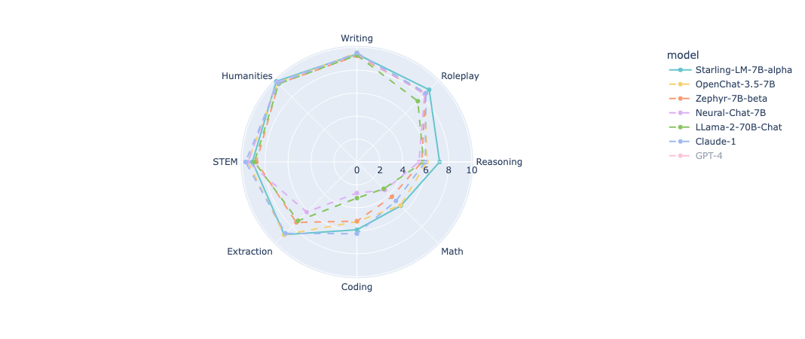
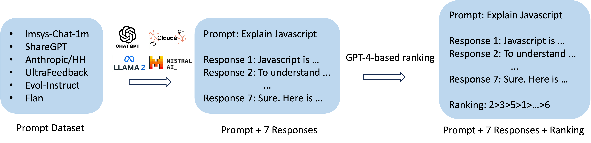
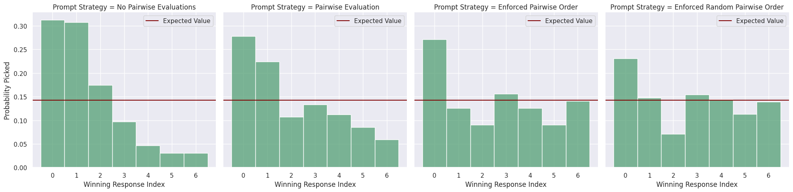
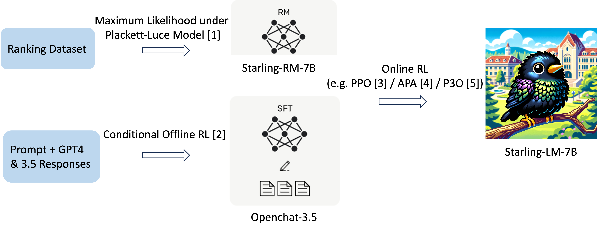

Author: Banghua Zhu * , Evan Frick * , Tianhao Wu * , Hanlin Zhu and Jiantao Jiao


</img>
<p style="color:gray; text-align: center;">Starling-LM-7B (generated by DALL·E 3) </p>

We introduce Starling-7B, an open large language model (LLM) trained by Reinforcement Learning from AI Feedback (RLAIF). The model harnesses the power of our new GPT-4 labeled ranking dataset, Nectar, and our new reward training and policy tuning pipeline. Starling-7B-alpha scores 8.09 in MT Bench with GPT-4 as a judge, outperforming every model to date on MT-Bench except for OpenAI's GPT-4 and GPT-4 Turbo. We release the ranking dataset [Nectar](https://huggingface.co/berkeley-nest/nector), the reward model [Starling-RM-7B-alpha](https://huggingface.co/berkeley-nest/Starling-RM-7B-alpha) and the language model [Starling-LM-7B-alpha](https://huggingface.co/berkeley-nest/Starling-LM-7B-alpha) on HuggingFace, and an online demo in LMSYS [Chatbot Arena](https://chat.lmsys.org). Stay tuned for our forthcoming code and paper, which will provide more details on the whole process.


</img> 
<p style="color:gray;">*Based on MT Bench evaluations, using GPT-4 scoring. Further human evaluation is needed.</p>

## Overview

Supervised fine-tuning (SFT) has demonstrated remarkable effectiveness in developing chatbot systems from language models, particularly when leveraging high-quality data distilled from ChatGPT/GPT-4 (examples include [Alpaca](https://huggingface.co/datasets/tatsu-lab/alpaca), [Vicuna](https://huggingface.co/lmsys/vicuna-7b-v1.5), [OpenHermes 2.5](https://huggingface.co/teknium/OpenHermes-2.5-Mistral-7B), and [Openchat 3.5](https://huggingface.co/openchat/openchat_3.5)).  However, the extent to which Reinforcement Learning from Human Feedback (RLHF) or AI feedback (RLAIF) can enhance models when scaling high-quality preference data remains an open question. Earlier endeavors in the open-source community, such as [Zephyra-7B](https://huggingface.co/HuggingFaceH4/zephyr-7b-beta), [Neural-Chat-7B](https://huggingface.co/Intel/neural-chat-7b-v3-1), and [Tulu-2-DPO-70B](https://huggingface.co/allenai/tulu-2-dpo-70b), employed [Direct Preference Optimization (DPO)](https://arxiv.org/abs/2305.18290), but their performance in MT Bench (and some in Chatbot Arena), when compared to leading SFT models like OpenHermes 2.5 and Openchat 3.5, has not fully showcased RLHF's potential.

To facilitate more thorough research into RLHF, a high-quality ranking dataset specifically for chat is essential. We release Nectar, a GPT-4 labeled ranking dataset composed of 183K chat prompts. Each prompt includes 7 responses distilled from various models like GPT-4, GPT-3.5-instruct, GPT-3.5-turbo, Mistral-7B-Instruct, Llama2-7B, resulting in a total of 3.8M pairwise comparisons. Considerable effort was invested in mitigating positional bias when prompting GPT-4 for rankings, the details of which are elaborated in the dataset section below.

Moreover, there is a notable scarcity of open-source reward models. We address this gap by releasing our reward model [Starling-RM-7B-alpha](https://huggingface.co/berkeley-nest/Starling-RM-7B-alpha), trained with our K-wise loss on the Nectar dataset. 

Lastly, we fine-tuned the [Openchat 3.5](https://huggingface.co/openchat/openchat_3.5) language model using the learned reward model. This resulted in an increase in the MT-Bench score from 7.81 to 8.09, and an improvement in the AlpacaEval score from 88.51% to 91.99%. Both metrics assess the chatbot's helpfulness. 

We hope the open-sourced dataset, reward model and language model can help deepen the understanding of the RLHF mechanism and contribute to AI safety research. Our team is actively exploring various training methodologies for both the reward and language models, and will continue to update this blog with our findings and model releases.


##  Evaluation of the Model

Evaluating chatbots is never a simple task. We mainly evaluate the helpfulness of our models based on [MT-Bench](https://arena.lmsys.org/) and [AlpacaEval](https://tatsu-lab.github.io/alpaca_eval/), which are GPT-4-based comparisons. We also test the basic capability of the model via MMLU. The results are listed below.

In line with findings in [GPT-4 Technical Report](https://arxiv.org/abs/2303.08774), our observations post-RLHF reveal similar trends. We've observed improvements in the model's helpfulness and safety features; however, its basic capabilities in areas like knowledge-based QA, math, and coding have either remained static or experienced minor regression. We also detected a tendency for the model to respond with excessive caution to certain benign prompts after initial RLHF, while still showing vulnerabilities to jailbreaking attempts. This may require further fine-tuning with rule-based reward models with GPT-4 as classifiers, similar to what is done in the [GPT-4 Technical Report](https://arxiv.org/abs/2303.08774). In the upcoming release of the paper, we will also benchmark the quality of the reward model, and the safety of the language model.

| Model                 | Tuning Method    | MT Bench | AlpacaEval | MMLU |
|-----------------------|------------------|----------|------------|------|
| GPT-4-Turbo           | ?                | 9.32     | 97.70      |      |
| GPT-4                 | SFT + PPO        | 8.99     | 95.28      | 86.4 |
| Starling-7B           | C-RLFT + APA     | 8.09     | 91.99      | 63.9 |
| Claude-2              | ?                | 8.06     | 91.36      | 78.5 |
| GPT-3.5-Turbo         | ?                | 7.94     | 89.37      | 70   |
| Claude-1              | ?                | 7.9      | 88.39      | 77   |
| Tulu-2-dpo-70b        | SFT + DPO        | 7.89     | 95.1       |      |
| Openchat-3.5          | C-RLFT           | 7.81     | 88.51      | 64.3 |
| Zephyr-7B-beta        | SFT + DPO        | 7.34     | 90.60      | 61.4 |
| Llama-2-70b-chat-hf   | SFT + PPO        | 6.86     | 92.66      | 63   |
| Neural-chat-7b-v3-1   | SFT + DPO        | 6.84     | 84.53      | 62.4 | 
| Tulu-2-dpo-7b         | SFT + DPO        | 6.29     | 85.1       |      |


The model is also currently included in LMSYS [Chatbot Arena](https://chat.lmsys.org) for both direct chat and anonymous comparisons for testing the human preferences. Please come and test it out!


In our evaluation of chat models, we've identified some limitations in using the [Huggingface OpenLLM Leaderboard](https://huggingface.co/spaces/HuggingFaceH4/open_llm_leaderboard) as a benchmark for chat model. Unlike Alpaca Eval and MT-Bench, the OpenLLM leaderboard doesn't support custom chat templates. This feature is crucial for nuanced model assessments, including Openchat 3.5, Llama 2 and other models which can be sensitive to chat template. Additionally, the OpenLLM leaderboard focuses on the basic capabilities of LLMs, while Alpaca Eval and MT Bench are designed for evaluating the chat assistants. Since RLHF doesn't inherently improve basic model capabilities, Alpaca Eval and MT-Bench are preferable for initial testing. Nevertheless, we believe the ultimate metric for model evaluation is human judgment, best exemplified by the LMSYS [Chatbot Arena](https://chat.lmsys.org).


It's important to highlight that the model's preference ranking by GPT-4 does not necessarily correlate with human preference, a phenomenon that echoes the principles of [Goodhart's Law](https://en.wikipedia.org/wiki/Goodhart%27s_law). Essentially, a higher MT-Bench score, as endorsed by GPT-4, doesn't automatically imply greater human favorability, especially compared to models with lower scores. The core competencies of the model, encompassing basic knowledge, reasoning, coding, and mathematics, remain unchanged. RLHF primarily enhances the style of the responses, in particular aspects of helpfulness and safety, as evidenced in its performance in MT-Bench and AlpacaEval. However, these results do hint at the potential of scaling online RL methods using extensive preference data. Our result shows that when the gold reward model is GPT-4's preferences, surpassing the performance of existing models is feasible with RLAIF. Therefore, adapting the preference data to include high-quality human responses could likely lead to improvements in aligning with human preferences.


## Dataset Overview

We present Nectar, the first high-quality 7-wise comparison dataset, generated through GPT-4-based ranking. For a high-quality RLHF dataset, one needs all the three components: diverse chat prompts, high-quality and diverse responses, along with accurate ranking labels. Our dataset's prompts are an amalgamation of diverse sources, including [lmsys-chat-1M](https://huggingface.co/datasets/lmsys/lmsys-chat-1m), [ShareGPT](https://sharegpt.com/), [Antropic/hh-rlhf](https://huggingface.co/datasets/Anthropic/hh-rlhf), [UltraFeedback](https://huggingface.co/datasets/openbmb/UltraFeedback), [Evol-Instruct](https://huggingface.co/datasets/WizardLM/WizardLM_evol_instruct_V2_196k), and [Flan](https://huggingface.co/datasets/SirNeural/flan_v2). Responses are primarily derived from a variety of models, namely GPT-4, GPT-3.5-turbo, GPT-3.5-turbo-instruct, [LLama-2-7B-chat](https://huggingface.co/meta-llama/Llama-2-7b-chat-hf), and [Mistral-7B-Instruct](https://huggingface.co/mistralai/Mistral-7B-Instruct-v0.1), alongside other existing datasets and models.


</img> 
<p style="color:gray;">*Illustrating the creation process of Nectar, a 7-wise comparison dataset for RLAIF.</p>

The most challenging aspect of creating Nectar was mitigating the positional bias inherent in GPT-4-based rankings. We extensively analyzed the likelihood of a response being selected as the top choice based on its position in the ranking prompt. Our initial findings, depicted in the first figure below, revealed a significant bias towards responses in the first and second positions when GPT-4 was simply asked to rank responses without additional reasoning.


</img> 
<p style="color:gray;">*The positional bias of  GPT-4-based ranking.</p>

To address this, as shown in the second figure, we instructed GPT-4 to first conduct pairwise comparisons for all response pairs before compiling a 7-wise ranking. This approach moderately reduced the positional bias. We have also explored having GPT-4 score or judge each prompt individually before summarizing in a 7-wise ranking, but this method did not effectively diminish the bias.

Further reduction of positional bias came with the introduction of a specific, and then a randomized, tie-breaking order, as demonstrated in the third and fourth figures, respectively. This approach proved most effective in counteracting positional bias, leading to the final methodology employed in curating the Nectar dataset.

We believe that Nectar will be a valuable resource for developers aiming to train more effective models using RLHF / RLAIF. It also offers high-quality responses for a diverse range of prompts, and can provide researchers with deeper insights into RLHF / RLAIF and the interplay between synthetic and human data.


## RLHF / RLAIF 

We train a reward model and conducting online RL based on the existing Nectar Dataset. Detailed below is our process, illustrated for clarity.

</img>

<p style="color:gray;">*Illustrating the RLHF / RLAIF process.</p>

Our reward model is fine-tuned from [Llama2-7B-Chat](https://huggingface.co/meta-llama/Llama-2-7b-chat-hf), and leverages the K-wise maximum likelihood estimator under the Plackett-Luce Model, as detailed in [our prior paper](https://arxiv.org/abs/2301.11270). We discovered that for 7-wise comparisons, this new estimator yields a more effective reward model than the original loss, which converts comparisons into pairwise and minimizes cross-entropy loss.

We selected [Openchat 3.5](https://huggingface.co/openchat/openchat_3.5) as the initial model for policy-finetuning, owing to its high MT Bench score (7.81). Our objective was to ascertain whether RLHF could enhance this score further. We experimented with three online RL methods: [Advantage-induced Policy Alignment (APA)](https://arxiv.org/abs/2306.02231), [Proximal Policy Optimization (PPO)](https://arxiv.org/abs/1707.06347), and [Pairwise Proximal Policy Optimization (P3O)](https://arxiv.org/abs/2310.00212). Despite the challenges in hyperparameter optimization for PPO, we found that, with optimal hyperparameter settings, these methods yielded comparably strong results. We ultimately selected a checkpoint from an APA run. 

Our trials with offline RL methods like [Direct Preference Optimization (DPO)](https://arxiv.org/abs/2305.18290) showed no significant improvements over the initial model Openchat 3.5. This is likely due to that Openchat 3.5 has already done [Conditioned RL Fine-Tuning (C-RLFT)](https://arxiv.org/abs/2309.11235), a different format of offline preference-based training, and offline RL methods may not be as effective as online RL with a high-quality reward model. In the future, we envision a better language model fine-tuning procedure being using (conditional) offline RL including DPO or C-RLFT to leverage reward information to create a strong initial model, and further improve the helpfulness and harmlessness with reward training and online RL. 

We observed that the quality of the preference dataset and reward model significantly influence the results, more so than the policy tuning method itself. We encourage the development of better reward learning methods, and invite researchers and developers to contribute to better open-source preference dataset, and utilize our dataset for training and testing. We believe it's likely that our dataset Nectar can bring higher gain with a larger reward model and language model, according to the [scaling laws of the reward model](https://arxiv.org/abs/2210.10760).

In our current implementation of online RL methods, we only unfreeze the last 4 layers of the model, aiming for faster training speed. The model is trained on 8 A100 GPUs with batch size 28 and 10k steps in total. In the future we plan to experiment with LoRA or full-parameter fine-tuning. This advancement could further enhance the overall quality of the model. More details about training and implementation will be soon released with the code and paper. 

### Evaluation of RLHF

Evaluating RLHF algorithms presents unique challenges, particularly in discerning whether performance gains are due to imitation of the best demonstration policies in offline-RL-based methods or  extrapolations of new reward signal in online-RL-based methods. We advocate for testing RLHF algorithms on our dataset, starting with models already proficient in learning from demonstrations, like Openchat 3.5. The ultimate benchmark should be the creation of models that surpass the initial model in both GPT-4 and human preferences.

However, training on GPT-4 preference data and evaluating against GPT-4-based scoring may invoke double layers of impact from Goodhart's laws. Over-optimization towards GPT-4 preferences could inadvertently harm actual human preferences. Similarly, the reward model, being a proxy for GPT-4 preference, might also misalign with GPT-4 preference itself when over-optimized. The challenge lies in effectively utilizing synthetic preference data to mitigate these issues and evaluating models with minimal human intervention.


## Limitations
Starling-7B, akin to other small-sized LLMs, has its limitations. It struggles with tasks involving reasoning or mathematics and may not always accurately self-identify or ensure the factual correctness of its outputs. Additionally, it's susceptible to jailbreaking prompts, as it wasn't explicitly trained for these scenarios. We also observe that in rare cases, the model may generate verbose or unnecessary content. We are committed to improving Starling-7B, exploring new reward training and policy training methods. We invite the community to collaborate with us in this endeavor to further improve the open dataset, reward models and language models with RLHF.

## License
The dataset, model and online demo is a research preview intended for non-commercial use only, subject to the data distillation [License](https://github.com/facebookresearch/llama/blob/main/MODEL_CARD.md) of LLaMA, [Terms of Use](https://openai.com/policies/terms-of-use) of the data generated by OpenAI, and [Privacy Practices](https://chrome.google.com/webstore/detail/sharegpt-share-your-chatg/daiacboceoaocpibfodeljbdfacokfjb) of ShareGPT. Please contact us if you find any potential violation.


## Acknowledgment
We would like to thank Wei-Lin Chiang from Berkeley for detailed feedback of the blog and the projects. We would like to thank the [LMSYS Organization](https://lmsys.org/) for their support of [lmsys-chat-1M](https://huggingface.co/datasets/lmsys/lmsys-chat-1m) dataset, evaluation and online demo. We would like to thank the open source community for their efforts in providing the datasets and base models we used to develope the project, including but not limited to Anthropic, Llama, Mistral, Hugging Face H4, LMSYS, OpenChat, OpenBMB, Flan and ShareGPT.

**✉ Correspondence to:** Banghua Zhu (banghua@berkeley.edu).

## Citation
```
@misc{starling2023,
    title = {Starling-7B: Increasing LLM Helpfulness & Harmlessness with RLAIF},
    url = {},
    author = {Zhu, Banghua and Frick, Evan and Wu, Tianhao and Zhu, Hanlin and Jiao, Jiantao},
    month = {November},
    year = {2023}
}
```
